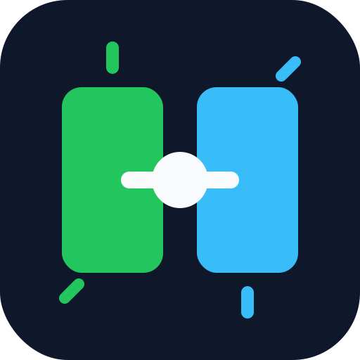

# Project Memory Bridge

<p align="center">
  
</p>

<p align="center"><strong>Persistent-memory bridge for Gentle-AI workflows using Engram, Graphify, and Obsidian.</strong></p>

<p align="center">
  
  
  
</p>

> `project-memory-bridge` is a **companion layer for Gentle-AI**. It does not replace Gentle-AI or Engram. It adds structured project memory, durable notes, and Graphify-powered repository discovery on top of the normal workflow.

## Table of Contents

- [What is this?](#what-is-this)
- [Quick Start](#quick-start)
- [What lives where](#what-lives-where)
- [Supported bootstrap paths](#supported-bootstrap-paths)
- [Bootstrap architecture](#bootstrap-architecture)
- [Repository structure](#repository-structure)
- [Configuration](#configuration)
- [Operation modes](#operation-modes)
- [When to use it](#when-to-use-it)
- [Credits](#credits)
- [Documentation](#documentation)
- [GitHub metadata](#github-metadata)
- [License](#license)

---

## What is this?

Project Memory Bridge exists to stop agents from **rediscovering the same large repository from scratch** every time they return.

It combines four layers with clear responsibilities:

| Layer | Role |
|---|---|
| **Gentle-AI** | Main workflow, orchestration, skills, SDD behavior |
| **Engram** | Operational memory and session continuity |
| **Graphify** | Repository structure, relationships, discovery |
| **Obsidian** | Durable project knowledge, notes, architecture history |

The goal is NOT “store everything”.
The goal is **spend tokens on reasoning, not on repeated repo reconstruction**.

---

## Quick Start

### 1. Prerequisites

- **Gentle-AI** already installed and working
- **Engram** available inside that workflow
- **Python 3.10+** for the bootstrap core
- **Graphify** if you want structural repository analysis
- **Obsidian** if you want local durable notes

### 2. Run bootstrap

macOS / Linux:

```bash
/ruta/a/project-memory-bridge/scripts/bootstrap.sh \
  --primary-agent opencode \
  --install-graphify \
  --install-skill \
  --client opencode
```

Windows PowerShell:

```powershell
.\scripts\bootstrap.ps1 --primary-agent opencode --install-graphify --install-skill --client opencode
```

### 3. Use the skill

1. Install the skill in your agent runtime.
2. Bootstrap the target repository.
3. Activate the skill during onboarding, architecture review, or `sdd-init`.
4. Read cheap memory first, then open raw code only when needed.

---

## What lives where

| Component | Responsibility |
|---|---|
| **This repo** | Skill contract, bootstrap scripts, config schema, note templates |
| **Gentle-AI** | Agent behavior, persona, SDD orchestration, normal Engram usage |
| **Target repo** | `.atl/memory-config.json`, `graphify-out/`, local project state |
| **Obsidian vault** | Durable notes, architecture summaries, project memory |

This repo is a **bridge layer**, not a standalone assistant framework.

---

## Credits

Project Memory Bridge builds on top of the work and ideas behind these tools and projects:

| Project | Role in this workflow |
|---|---|
| **[Gentle-AI](https://github.com/Gentleman-Programming/gentle-ai)** | Base workflow, agent behavior, persona, SDD, and orchestration |
| **[Graphify](https://github.com/safishamsi/graphify)** | Repository graph generation and structural discovery |
| **[Engram](https://github.com/Gentleman-Programming/engram)** | Operational memory and continuity across sessions |
| **[Obsidian](https://obsidian.md/)** | Durable local project knowledge and notes |

This repository is meant to **extend** those workflows, not to replace or erase their contribution.

---

## Supported bootstrap paths

| Platform | Entry point | Python handling |
|---|---|---|
| macOS | `scripts/bootstrap.sh` | Detects Python 3.10+, installs via Homebrew if missing |
| Linux | `scripts/bootstrap.sh` | Detects Python 3.10+, asks for manual install if missing |
| Windows | `scripts/bootstrap.ps1` | Detects Python 3.10+, installs via `winget` or `scoop` if possible |
| Core logic | `scripts/bootstrap.py` | Shared bootstrap behavior across platforms |

---

## Bootstrap architecture

The bootstrap is intentionally split in two layers:

- **platform launcher** → obtains Python 3.10+
- **Python core** → performs the real bootstrap

### Why this split matters

A single `.py` file is cleaner and more maintainable for shared logic.

But a pure Python entrypoint fails immediately if Python is missing.

So the launchers solve the runtime dependency first, then call the core.

### Real dependency order

1. launcher resolves **Python 3.10+**
2. `bootstrap.py` verifies the target repo
3. creates `.atl/`
4. ensures **graphifyy** via `uv`, `pipx`, or `pip`
5. runs `graphify install`
6. writes `.atl/memory-config.json`
7. creates Obsidian folders and seed notes
8. runs `graphify update .` if enabled
9. optionally installs the skill into the agent runtime

This order matters because the final config should reflect **real available capabilities**, not wishful ones.

### Skill installation targets

If you pass `--install-skill`, the bootstrap can also copy the skill runtime files.

Resolution order:

1. `--skill-dir` if you provide it
2. client-aware destination if supported
3. `~/.agents` as generic global fallback
4. `<target-repo>/.agents` when `--scope project`

Today the generic fallback is the safest default for clients like **OpenCode** and **Codex**.

If `~/.agents` does not exist, the script becomes **interactive by default**:

- it explains what `~/.agents` is for
- asks whether you want to create it
- creates it only if you confirm

If you want non-interactive behavior, pass:

```bash
--yes
```

---

## Repository structure

```text
project-memory-bridge/
├── SKILL.md
├── README.md
├── RELEASE_NOTES_v0.1.0.md
├── assets/
│   ├── logo.svg
│   └── memory-config.schema.json
├── scripts/
│   ├── bootstrap.py
│   ├── bootstrap.sh
│   └── bootstrap.ps1
└── references/
    ├── operating-model.md
    └── obsidian-templates.md
```

---

## Configuration

The expected config file is:

```text
.atl/memory-config.json
```

The lightweight schema lives in:

```text
assets/memory-config.schema.json
```

### Common options

```bash
--project-root PATH
--project-name NAME
--vault-root PATH
--project-dir PATH
--primary-agent NAME
--graphify-output-dir DIR
--install-graphify
--install-skill
--client generic|opencode|codex
--scope global|project
--skill-dir PATH
--skip-graphify-update
--disable-obsidian
--disable-graphify
--yes
```

---

## Operation modes

| Mode | What it does |
|---|---|
| `bootstrap` | Creates config and minimum memory foundations |
| `hydrate` | Fills notes with real project knowledge |
| `consume` | Uses existing memory without repopulating it |
| `update` | Refreshes only durable knowledge affected by a change |

The skill is designed to stay **LLM-first**:

- short runtime contract in `SKILL.md`
- heavier detail moved to `references/`
- schema and install artifacts moved to `assets/` and `scripts/`

---

## When to use it

Use it when:

- onboarding an existing repository
- running `sdd-init` or planning on a medium/large repo
- reviewing architecture or bounded contexts
- reducing repeated context rebuilds across sessions

Do **not** use it for:

- tiny one-file edits
- already-known local fixes
- conceptual questions detached from the repository

---

## Documentation

| Document | Purpose |
|---|---|
| `SKILL.md` | Runtime contract for the skill |
| `references/operating-model.md` | Bootstrap, hydrate, consume, update model |
| `references/obsidian-templates.md` | Suggested durable note structure |
| `RELEASE_NOTES_v0.1.0.md` | First public beta release notes |

---

## GitHub metadata

**About**

```text
Persistent-memory bridge for Gentle-AI workflows using Engram, Graphify, and Obsidian.
```

**Topics**

```text
ai llm agent memory engram obsidian graphify sdd developer-tools knowledge-management repository-analysis prompt-engineering gentle-ai
```

**Current version**

```text
v0.1.0
```

---

## License

MIT
